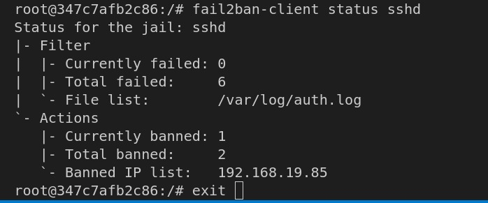
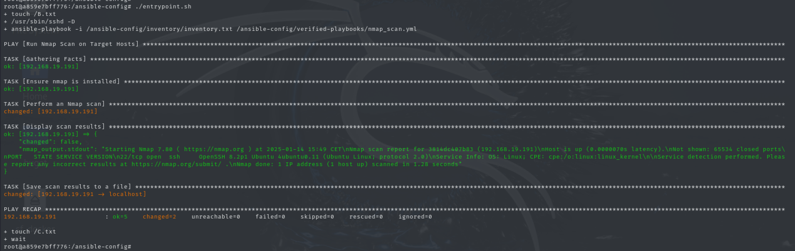
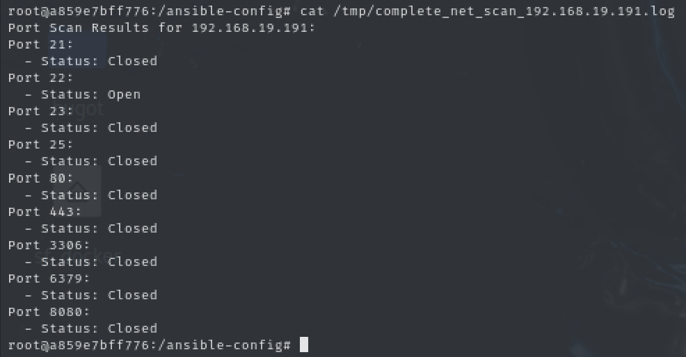
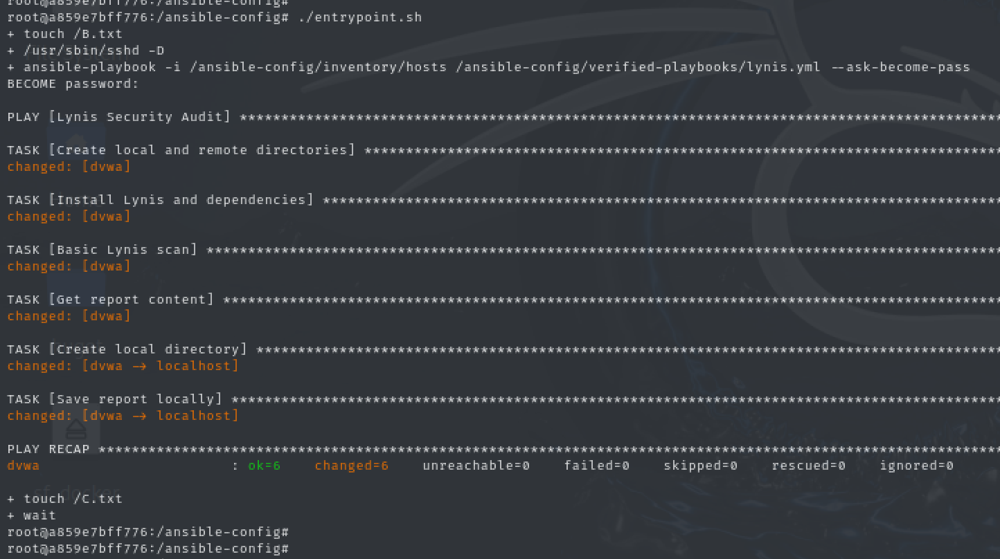
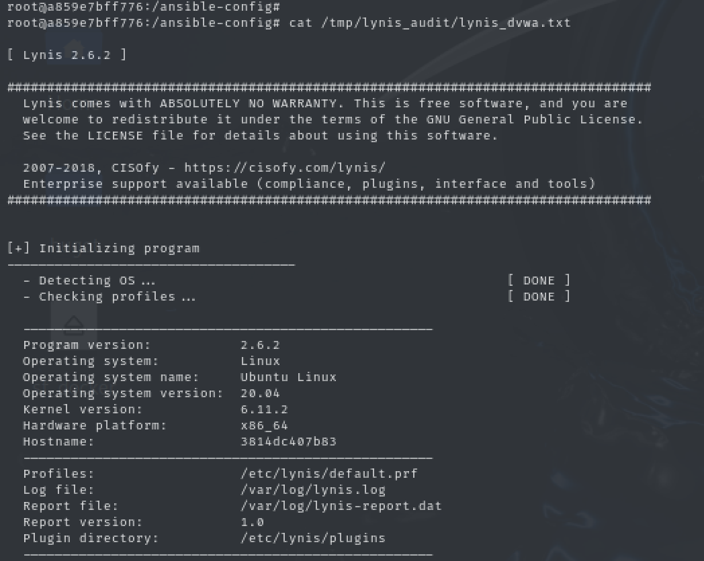

# 🛡️ Cyber Defence Dan Group Project - INSA 2024

## 📄 Description

This project is designed to replicate a simple IT architecture using Docker containers. Once the containerized basic architecture is set up, we proceed by creating some vulnerabilities and try to detect and respond to them using **Ansible modules**. 

### Scenarios Covered:
- Deployment of a vulnerable containerized machine (such as **DVWA**) and analysis of network-based vulnerabilities using Ansible modules.

The main objective is to deepen our knowledge of **Ansible playbooks** and **Docker containers** by working on realistic scenarios involving automation and container management.

---

## ⚙️ Prerequisites

Before cloning the GitHub repository, ensure your environment meets the following requirements:

- **Operating System**: Ubuntu 22.04
- **Docker**: Version 20.10.27 or later
- **Ansible**: Version 2.10.8 or later

> ⚠️ Proper installation and configuration of these tools are essential for the project to function correctly. Once your system is ready, you can proceed to clone the repository and start working on the lab.

---

## 🛠️ Steps to Set Up the Project

### 1️⃣ Configure the `var.env` File
- This file contains the IP addresses of the machines and is located in the `solution` folder.

### 2️⃣ Grant Execution Rights to the Script
Run the following command to make the script executable:
```bash
chmod +x ./command.sh
```

### 3️⃣ Launch the Script `command.sh`
Execute the script using:
```bash
./command.sh
```

### 4️⃣ Configure Docker Containers
- Navigate to the folder `Solution/docker/ubuntu-controller2`.
- Execute the command specified in the `explication.txt` file.
- Verify the setup by running:
```bash
docker ps
```
You should see the three containers necessary for the project.

> 📝 This script allows the playbooks to run from the controller machine (Ubuntu container) to the target machine (DVWA container).

### 5️⃣ Wait for Complete Execution
The playbooks may take some time to execute as they also generate reports.

### 6️⃣ View Results
- Connect to the controller machine (Ubuntu container):
```bash
docker exec -it <controller-container-name> bash
```
- The results of the playbooks will be available in the folder `/tmp`.

---

## 💡 Tips and Notes
- Use `docker logs <container-name>` to debug any issues with the containers.
- Check Ansible logs for detailed playbook execution traces in `/var/log/ansible.log`.
- For advanced configurations, modify the `ansible.cfg` file located in the root directory.

---

## 🖼️ Example Output
```plaintext
PLAY [Detect Vulnerabilities] *************************************************

TASK [Gathering Facts] *********************************************************
ok: [target_machine]

TASK [Check for open ports] ****************************************************
changed: [target_machine]

PLAY RECAP *********************************************************************
target_machine              : ok=5    changed=2    unreachable=0    failed=0    skipped=0    rescued=0    ignored=0
```

---

## 📂 Project Structure
```
├── README.md
├── Solution
│   ├── docker
│   │   ├── ubuntu-controller2
│   │   │   ├── Dockerfile
│   │   │   ├── explication.txt
│   ├── var.env
├── command.sh
```

---

---

## 🖼️ Screenshots of Results

Below are some screenshots showing the results of running the playbooks and analyzing the vulnerabilities:

### 🖥️ Playbook Execution & Results


### 🔍 Vulnerability network scan 



### 📊 Generated Reports lynis



---

